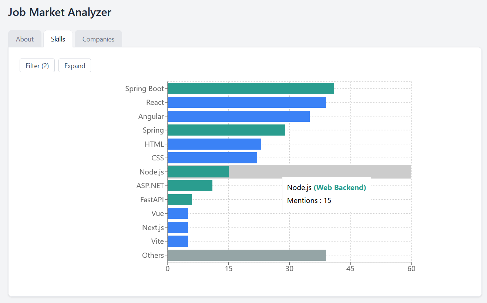

# Job Market Analyzer

Data pipeline for extracting information about open job positions such as: skills required, salary, company. The data is served via REST API's on the backend and dashboards on the frontend. The project's goal is to help you understand the hiring trends to make informed career decisions.

[Live Demo](https://job-market-analyzer-live-demo.vercel.app/)



## Description

When you run the project the data will be available through the frontend dashboards as the repository holds the database snapshot. You can also investigate the data by connecting to the database and writing SQL querries. 

On the backend, after starting application, the data pipeline starts gathering information from the web to update the database. The updates are also sheduled every day at 2 AM.

The data pipeline consists of:
1. web scraping the information about currently open job positions along with the description
2. extracting skills from the description via phrase matching
3. cleaning the data
4. saving the data to the database

> Warning: after starting application the data pipeline starts to activly use the internet to update the information if you want to opt out comment the following line in `backend/app/main.py`:

```py
threading.Thread(target=run_pipeline).start()
```

## Tech stack 

### 1. Backend

- Python
- pandas
- FastAPI
- SQLite
- Natural Language Processing

### 2. Frontend

- React
- TypeScript
- Tailwind CSS
- Vite

### 3. Other

- Docker

## Getting started

### 1. Prerequisites:
 - [Docker](https://docs.docker.com/get-started/get-docker/) and [Docker Compose](https://docs.docker.com/compose/install/) installed

### 2. Run

```bash
# Clone the repository
git clone https://github.com/IliaPoliak/Job-Market-Analyzer
cd Job-Market-Analyzer

# Start all services
docker compose up -d
```

### 3. After Start

You can see the data pipeline progress information in the `backend/app/pipeline_progress.log`

The frontend will be available at http://localhost:5173/

The backend will be available at http://localhost:8000


## Future work

The project is in development and I plan to release more features soon
